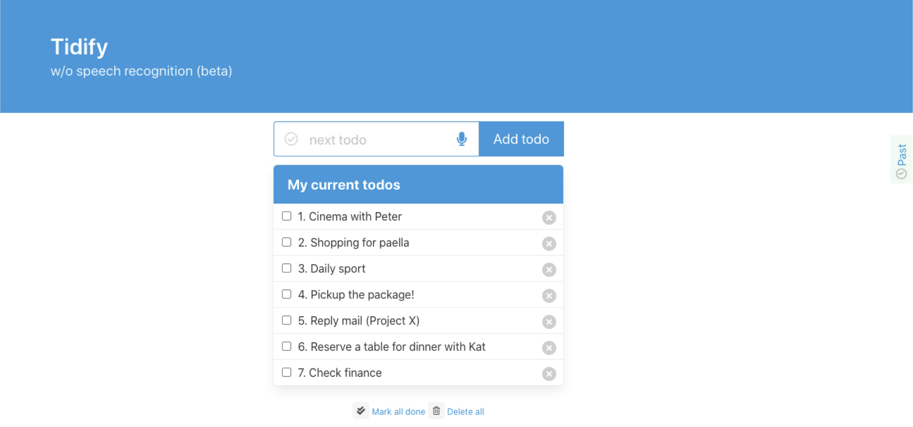
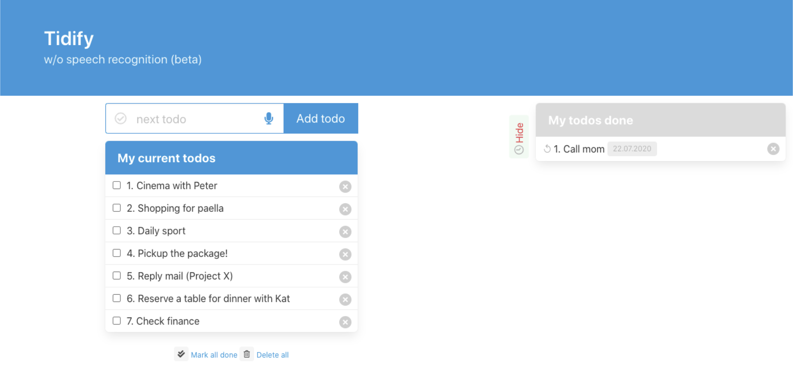

# Tidify

## Description

"Tidify" is a fully equipped and clean-looking todo list with voice recognition. It has all the functionalities one would expect: create todo, mark/remark as done, delete, show archived todos and more. 





### Getting Started
To run "Tidify", just start `todolist.html`. In order to use voice recognition correctly, `todolist.html` needs to be run in a server environment (including localhost).

To active voice control, click on the microphone symbol in the search field to activate/stop speech recognition.

Current voice commands for the speech recognition:

- "Create *your todo*"
- "Delete item x *(the number shown in the list before each todo)*"
- "Check item x *(the number shown in the list before each todo)*" (this marks a todo as checked and transfer it to the past list)
- "Show" (this shows the past todos list)
- "Hide" (this hides the past todos list)
- "Recover item x *(the number shown on the list before each todo done)*" (this moves the todo from the past list back to the todo list)
- "Delete all todos"
- "Delete all past" (delete all past todos)
- "Check all" (mark all active todos as done and move to the past list) 
- "Uncheck all" (remove all past todos to the current active todos list)

### Expanding current voice commands

You can easily add your own voice command by modifying the file `speech_cmds.js`. Below is an example of the voice command "create":

```javascript
// speech_cmds.js

let name = "create"; /* name your voice command */
let regex = new RegExp ("^create", "i"); /* how your voice command can be extracted from the string which is given you by the SpeechRecognition API */
let exe = function (transcript) {
    let todo = transcript.split("create")[1];
    if (todo)
        add_item(todo);  
}; /* the function to be executed when your voice command is recognized */
create_command(name, regex, exe);
```

You can also adapt the voice recognition language by adapting the following line in the file `speech.js`:

```javascript
// speech.js
recognition.lang = 'en-US'; /* adapt to your language */
```

## Acknowledgement

[Official MDN SpeechRecognition API website](https://developer.mozilla.org/en-US/docs/Web/API/SpeechRecognition)
